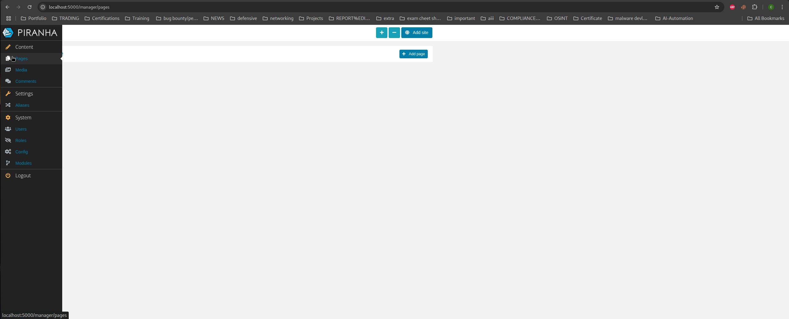
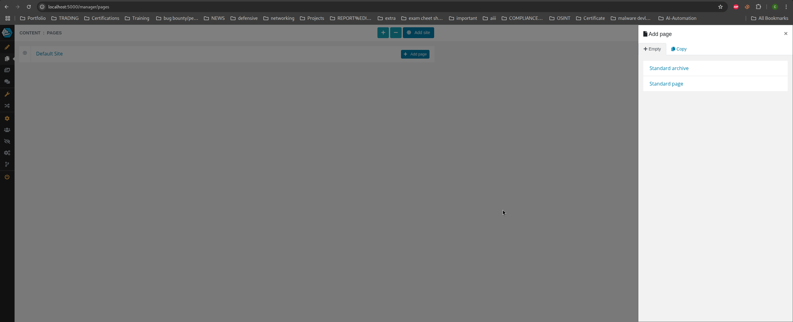
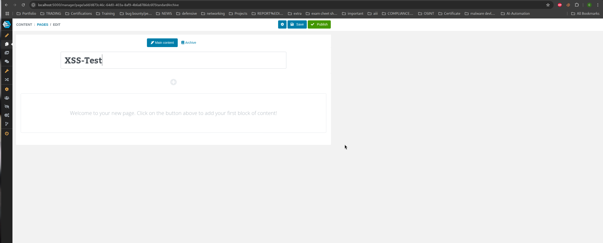
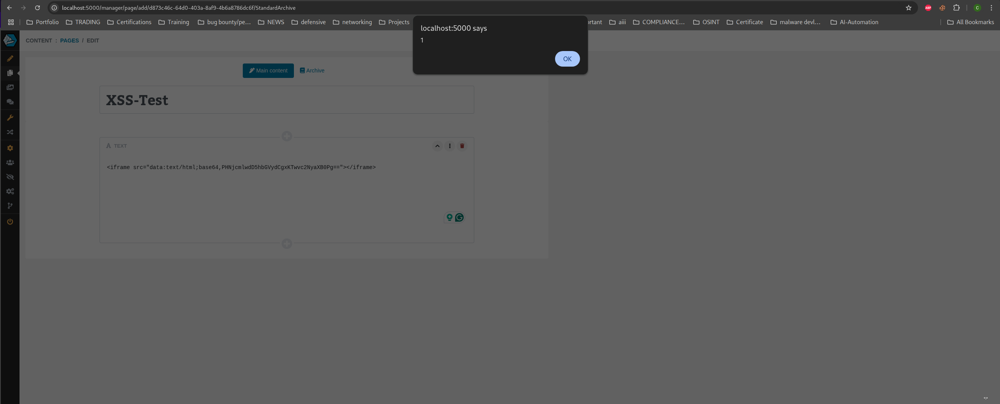
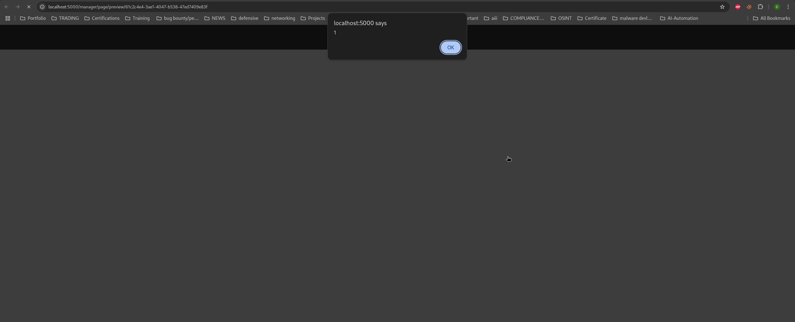

# Public Disclosure: Stored XSS in Text Block – Piranha CMS 12.0 #

<b>Title</b>:<br> Stored Cross-Site Scripting in Text Block of Standard and Archive Pages in Piranha CMS 12.0

### Summary: ###
Piranha CMS 12.0 contains a stored cross-site scripting (XSS) vulnerability affecting the “Text” content block used in both Standard Page and Standard Archive Page types. When adding text content via the page editor, user-supplied HTML is not properly sanitized. An authenticated user can inject JavaScript payloads that are saved with the page content. These scripts are executed immediately upon save and every time the page is previewed or accessed, resulting in persistent XSS. This presents a serious risk for shared admin environments and can lead to account compromise or unauthorized data access.

<b>CVE ID:</b>
(Pending Assignment)

<b> Vendor:</b><br>
https://piranhacms.org<br>
https://github.com/PiranhaCMS/piranha.core

<b>Affected Product:</b><br>
Piranha CMS version 12.0<br>
https://github.com/PiranhaCMS/piranha.core/releases/tag/v12.0

<b>Affected Component:</b><br>
Pages → Standard Page / Standard Archive →  Content Block --> Text <br>
Path: /manager/pages<br>

## <b> Proof-of-Concept (PoC)</b> ##

1. Log in to the Piranha CMS admin panel at /manager/login
   
2. Navigate to the Pages section
   

3. Click “Add Page” and choose either:

Standard Page, or Standard Archive
   

4  Enter a page title (e.g., XSS-Test)
   

5. Click the [+] button and select “Text” under “Content”

6 In the text input area, paste one of the following payloads:

Payload A
 ```bash 

 ```


Payload B

 ```bash 
<iframe src="data:text/html;base64,PHNjcmlwdD5hbGVydCgxKTwvc2NyaXB0Pg=="></iframe>
```

Payload C

 ```bash 
<details open ontoggle=alert('XSS')>Click</details>
```
   


7 Click Save and  Click Preview

 Boom 
 it executes again. Anyone who accesses  the page triggers the XSS.
   


<b>Impact:</b>
<br>
Persistent (Stored) Cross-Site Scripting (XSS): Injected scripts are saved as part of the page content.<br>
Automatic Execution: Payloads execute every time the page is accessed, previewed, or viewed by any user.<br>
Session Compromise: May lead to session hijacking or theft of sensitive data such as cookies, tokens, or local/session storage.<br>
Privilege Abuse: Enables malicious authenticated users to target other admins or editors, escalating access or impersonating users.<br>
Multi-Page Exposure: Affects both Standard Pages and Standard Archive Pages, increasing the overall attack surface.<br>

