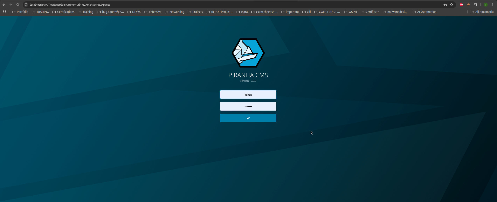
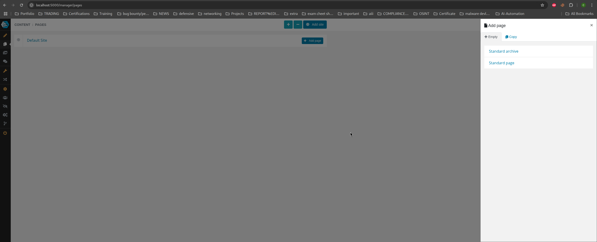
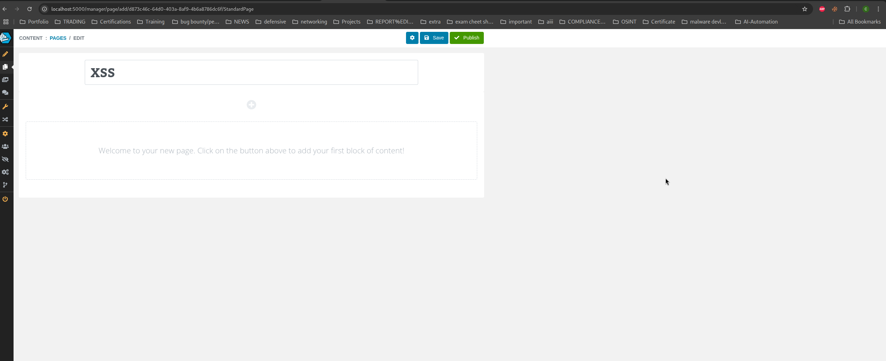
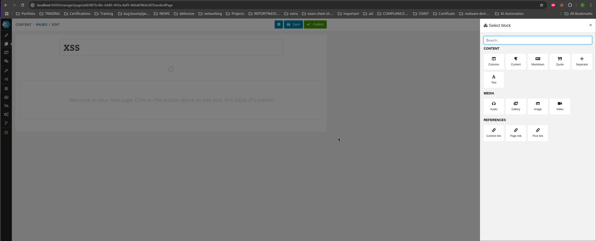
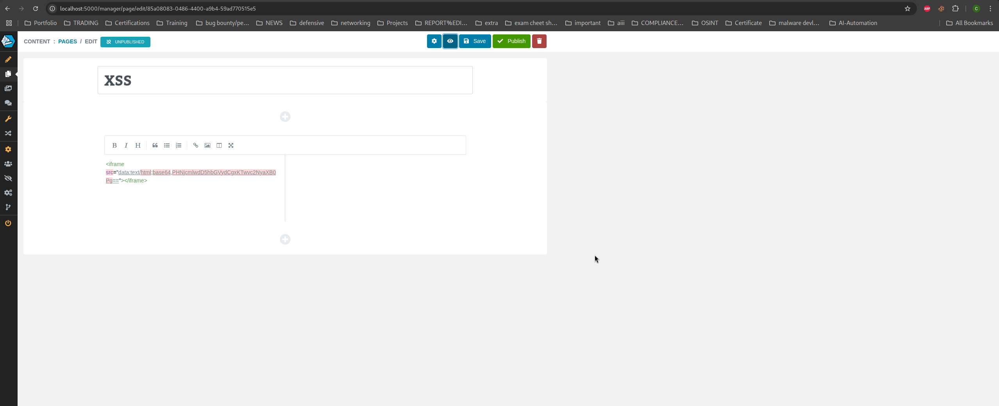
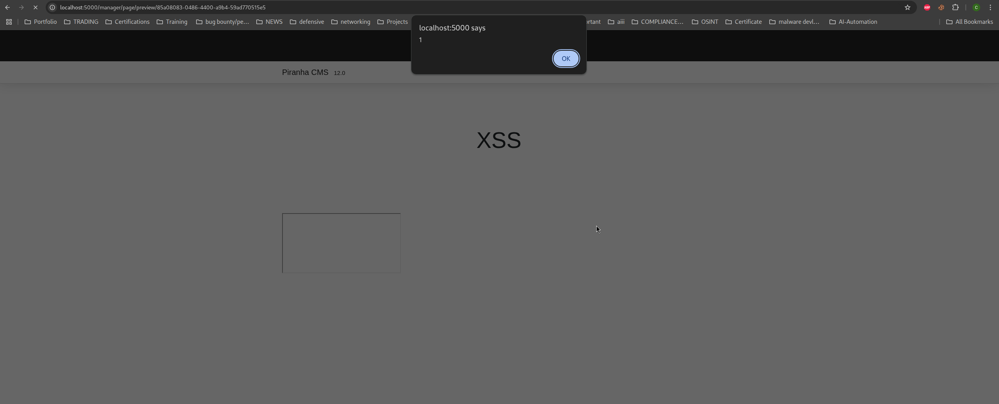

# Public Disclosure: Stored XSS in Markdown Block – Piranha CMS 12.0 #

<b>Title:</b><br>
Stored Cross-Site Scripting (XSS) in Markdown Content Block of Piranha CMS 12.0

<b>Summary</b><br>
Piranha CMS v12.0 contains a stored cross-site scripting (XSS) bypass in the Markdown content block used within Standard Page and Standard Archive Page types. After the vendor added DOMPurify in v12.0 to address the earlier Markdown XSS (CVE-2024-55341.which affected v11.1), certain edge-case HTML/JS payloads remain unsanitized. An authenticated user can insert crafted JavaScript into a Markdown block; the payload is stored and executed during page preview and again when the page is published and viewed publicly. This represents a bypass of the prior remediation, expanding impact from editor-only execution to execution affecting preview and published pages and thus both authenticated and unauthenticated viewers.


<b>CVE ID</b><br>
CVE-2025-61413.


<b> Vendor</b><br>
 https://piranhacms.org<br>
GitHub: https://github.com/PiranhaCMS/piranha.core

<b>Affected Product</b><br>
Product: Piranha CMS<br>
Version: 12.0<br>
https://github.com/PiranhaCMS/piranha.core/releases/tag/v12.0


<b> Affected Component(s)</b>
Markdown Content Block<br>
Page Editor (/manager/pages)<br>
Standard Page<br>
Standard Archive Page<br>


### <b>Proof-of-Concept (PoC)</b> ###

1. Log into Piranha CMS as an authenticated user via /manager/login.
    

2. Go to Pages, and select or create a new page of type:<br>
    Standard Page, or Standard Archive Page
    

3. Enter any title and click Save.
   XSS
     


4. Click the ➕ Add Block button.<br>
  Select the Markdown block.
    

5. Paste any of the following payloads into the Markdown field:

 ```bash
<iframe src="data:text/html;base64,PHNjcmlwdD5hbGVydCgxKTwvc2NyaXB0Pg=="></iframe>
```

 ```bash
<details open ontoggle=alert('XSS')>Click</details>
```


6. Click Save and Now click Preview <br>
✅ Result:<br>
The XSS payload is triggered on page render.<br>
Any authenticated user or external visitor who opens the page will execute the malicious script in their browser.<br>


<b> Credit- Researcher(s):</b> Chidubem Chukwu, Prashanth BusiReddyGari (University Of North Carolina at Pembroke–Cybersecurity Reddy Research group)

